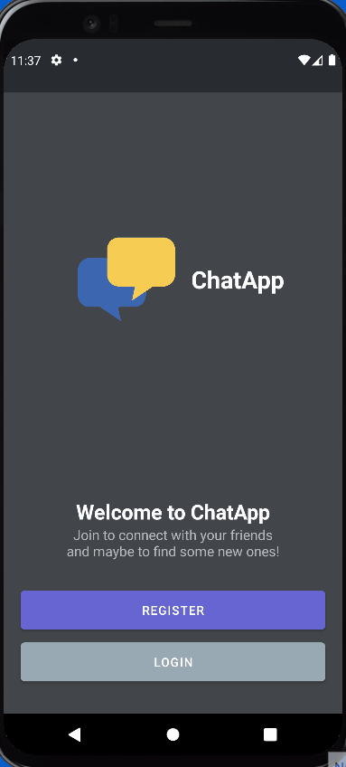

# CHATAPP

Instant messaging chat application with channels, similar to Discord.

For this project

- In backend I used GraphQL, MongoDB Atlas, Typescript and mongoose
- In frontend I used React Native / Expo, Typescript, Apollo Client for state management

Cd into backend first and start it with npm start and frontend also with npm start.

## backend

Add your own .env file and add PORT for the port the backend will use when started. Then MONGODB_URI with your own MongoDB Atlas url. SECRET for the jwt password and DURATION for jwt token's time limit.

## Things to implement

- Add notification when user is added to the channel
- Get GraphQL subscriptions to work
